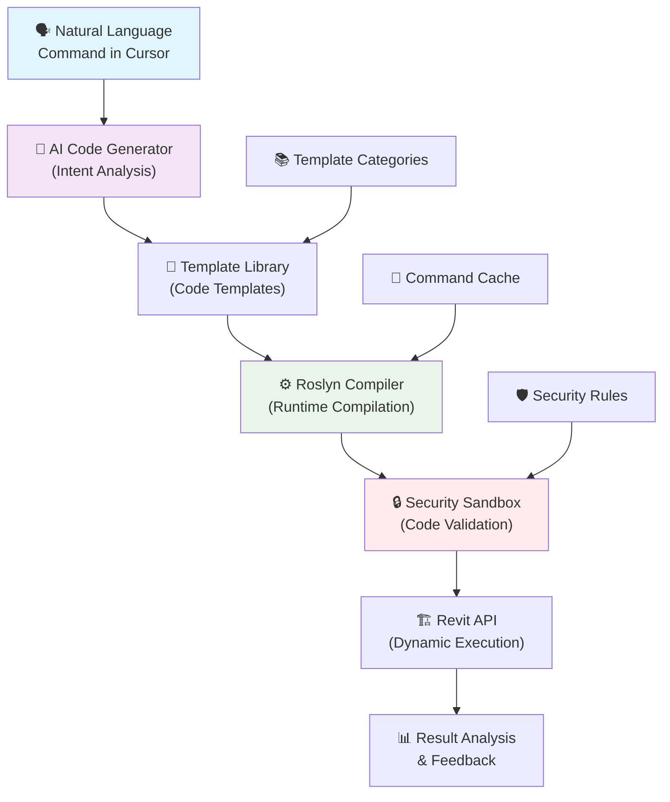

# 🚀 Smart Revit MCP Server v2.0

> **Революционный подход к автоматизации Revit через естественный язык с динамической генерацией команд!**

**Smart Revit MCP Server** — это продвинутый сервер Model Context Protocol (MCP), который позволяет взаимодействовать с Autodesk Revit через естественный язык. Система использует **динамическую генерацию и компиляцию C# кода** через Roslyn для выполнения любых команд в реальном времени.

## 🌟 Ключевые возможности

### 🎯 **Динамические команды (НОВОЕ!)**
- **Любая команда на естественном языке** - "Создай систему вентиляции для больницы"
- **Автоматическая генерация C# кода** через AI и компиляция через Roslyn
- **Интеллектуальные шаблоны** для различных типов задач
- **Система безопасности** с проверкой кода перед выполнением
- **Кэширование команд** для высокой производительности

### 🏗️ **Специализированные MEP инструменты**
- **Умные воздуховоды** с обходом препятствий и алгоритмом A*
- **Интеллектуальные трубопроводы** с оптимальной маршрутизацией
- **Анализ пространства** для оптимального размещения оборудования
- **Поиск маршрутов** с учетом препятствий и зазоров

### 🤖 **AI-интеграция**
- **Cursor/Claude интеграция** для команд на естественном языке
- **Автоматическое понимание намерений** пользователя
- **Контекстное выполнение** команд с учетом специфики проекта

## 📦 Установка и настройка

### 1. Сборка и установка Revit плагина

```bash
# Перейти в папку плагина
cd mymcp/mymcp

# Собрать проект
dotnet build -c "Debug R25"  # Для Revit 2025

# Установить плагин (копировать .addin файл в папку Revit)
```

### 2. Установка MCP сервера

```bash
# Установить зависимости
npm install

# Собрать проект
npm run build

# Запустить в режиме разработки
npm run dev
```

### 3. Настройка Cursor

Добавьте в `settings.json` Cursor:

```json
{
  "mcp": {
    "mcpServers": {
      "smart-revit": {
        "command": "node",
        "args": ["C:\\path\\to\\mymcp-server\\dist\\index.js"],
        "env": {
          "NODE_ENV": "production"
        }
      }
    }
  }
}
```

## 🎮 Использование

### 🚀 Динамические команды (Универсальный инструмент)

Используйте инструмент `mcp_smart-revit_execute_dynamic_revit_command` для выполнения **любых** команд:

```typescript
// Примеры команд на естественном языке:

// 🏥 Медицинские учреждения
"Создай систему вентиляции для операционной с HEPA фильтрацией"
"Спроектируй медицинские газы для палаты интенсивной терапии"

// 🏢 Офисные здания  
"Создай зональную систему кондиционирования для офиса на 100 человек"
"Оптимизируй энергопотребление HVAC системы"

// 🏭 Промышленные объекты
"Спроектируй систему дымоудаления для производственного цеха"
"Создай аварийную вентиляцию с учетом взрывоопасных зон"

// 🏠 Жилые дома
"Создай умную климатическую систему для частного дома"
"Спроектируй теплый пол с зонированием по комнатам"
```

**Параметры:**
- `command_description`: Описание команды на русском или английском
- `complexity_level`: `simple | moderate | complex | advanced`
- `safety_mode`: `true` для дополнительных проверок безопасности
- `optimization_level`: `speed | quality | balanced`

### 🔧 Специализированные инструменты

#### Создание умного воздуховода
```typescript
mcp_smart-revit_smart_create_duct({
  start_point: { x: 10, y: 5, z: 12 },
  end_point: { x: 50, y: 25, z: 12 },
  width: 2.0,    // футы
  height: 1.0    // футы
})
```

#### Анализ пространства здания
```typescript
mcp_smart-revit_analyze_building_space({
  center_point: { x: 25, y: 15, z: 10 },
  radius: 15.0,
  analysis_type: "hvac"
})
```

#### Поиск оптимального маршрута
```typescript
mcp_smart-revit_find_optimal_route({
  start_point: { x: 0, y: 0, z: 10 },
  end_point: { x: 100, y: 50, z: 10 },
  clearance: 1.0,
  route_type: "duct"
})
```

## 🏗️ Архитектура системы



## 🔐 Безопасность

### Система безопасности включает:

- **Песочница для кода** - проверка синтаксиса и опасных операций
- **Whitelist пространств имен** - только разрешенные Revit API
- **Блокировка опасных методов** - файловые операции, процессы
- **Валидация параметров** - проверка входных данных
- **Ограничения по времени** - предотвращение зависания

### Разрешенные пространства имен:
```csharp
✅ Autodesk.Revit.DB.*
✅ Autodesk.Revit.UI
✅ System.Collections.Generic
✅ System.Linq
✅ System.Math
✅ mymcp.Analysis.*

❌ System.IO.File
❌ System.Diagnostics.Process  
❌ System.Reflection.*
```

## 🎯 Примеры использования

### 🏥 Медицинский центр
```
"Создай систему вентиляции для медицинского центра:
- Операционная: 20 воздухообменов/час, HEPA фильтры
- Палаты: 6 воздухообменов/час, избыточное давление
- Коридоры: 4 воздухообмена/час
- Интеграция с системой контроля инфекций"
```

### 🏢 Офисное здание
```
"Спроектируй энергоэффективную HVAC систему:
- VRF система для периметральных зон
- VAV для внутренних зон
- Рекуперация тепла 85%
- Интеграция с системой умного здания
- CO2 мониторинг для оптимизации воздухообмена"
```

### 🏭 Производственный цех
```
"Создай промышленную вентиляцию:
- Местные отсосы для сварочных постов
- Общеобменная вентиляция с учетом тепловыделений
- Система аварийного дымоудаления
- Взрывозащищенное исполнение для зоны 1"
```

## 📊 Мониторинг и отладка

### Проверка состояния системы:
```typescript
mcp_smart-revit_revit_health_check()
```

**Результат:**
```
🟢 Система работает отлично!

🔌 Подключение к Revit: ✅ Активно
📄 Документ: Hospital_HVAC_Project.rvt
🕐 Время проверки: 15.01.2024, 14:30:25
📦 Версия: 2.0.0

🚀 Динамические команды: ✅ Включены
💾 Кэшированных команд: 15
✅ Валидных команд: 15

🎯 Готов к выполнению любых команд!
```

## 🚀 Расширенные возможности

### Кэширование команд
- Автоматическое кэширование скомпилированных команд
- Время жизни кэша: 1 час
- Предварительная компиляция часто используемых команд

### Система шаблонов
- **HVAC шаблоны** - для систем отопления, вентиляции, кондиционирования
- **Plumbing шаблоны** - для водоснабжения, канализации
- **Electrical шаблоны** - для электрических систем
- **Architecture шаблоны** - для архитектурных элементов
- **Complex шаблоны** - для комплексных многосистемных проектов

### Уровни сложности
- **Simple** - базовые операции (создание элементов)
- **Moderate** - системы с маршрутизацией
- **Complex** - многосистемные проекты
- **Advanced** - оптимизация и интеграция

## 🔧 Разработка

### Добавление новых шаблонов:
```csharp
var customTemplate = new CommandTemplate
{
    Id = "custom_hvac_hospital",
    Name = "Hospital HVAC System",
    Category = "Medical",
    SecurityLevel = SecurityLevel.High,
    Tags = new[] { "hospital", "medical", "hvac", "infection-control" },
    CodeTemplate = @"
        // Медицинская HVAC система
        var medicalAnalyzer = new MedicalSpaceAnalyzer(uiApp);
        var infectionControl = new InfectionControlSystem();
        
        {{GENERATED_LOGIC}}
    "
};

templateLibrary.AddTemplate(customTemplate);
```

### Логирование:
```csharp
Logger.Info("Command executed successfully");
Logger.Warning("Potential optimization available");
Logger.Error("Critical error occurred", exception);
```

## 🐛 Устранение неполадок

### Типичные проблемы:

**1. Не удается подключиться к Revit**
```
🔧 Проверьте:
• Revit запущен
• Плагин загружен (ленте должна быть кнопка "Start MCP Server")
• Порт 3001 свободен
• Нет блокировки firewall
```

**2. Ошибка компиляции динамической команды**
```
🔧 Проверьте:
• Описание команды содержит достаточно деталей
• Не используются запрещенные операции
• Правильность синтаксиса в сгенерированном коде
```

**3. Низкая производительность**
```
🔧 Оптимизация:
• Используйте кэшированные команды
• Снизьте complexity_level
• Установите optimization_level: "speed"
```

## 📈 Планы развития

- **🧠 Интеграция с GPT-4** для более умной генерации кода
- **🔗 API интеграция** с внешними системами (BIM 360, ACC)
- **📊 Аналитика производительности** систем
- **🌐 Web интерфейс** для мониторинга
- **📱 Mobile приложение** для удаленного управления
- **🔄 Интеграция с Git** для версионирования команд

## 📄 Лицензия

MIT License - см. файл LICENSE для деталей.

## 🤝 Вклад в развитие

Приветствуются pull requests и issues! Особенно нужна помощь с:
- Новыми шаблонами команд
- Оптимизацией алгоритмов маршрутизации  
- Расширением системы безопасности
- Документацией и примерами

---

**Создано с ❤️ для инженеров MEP и архитекторов** 