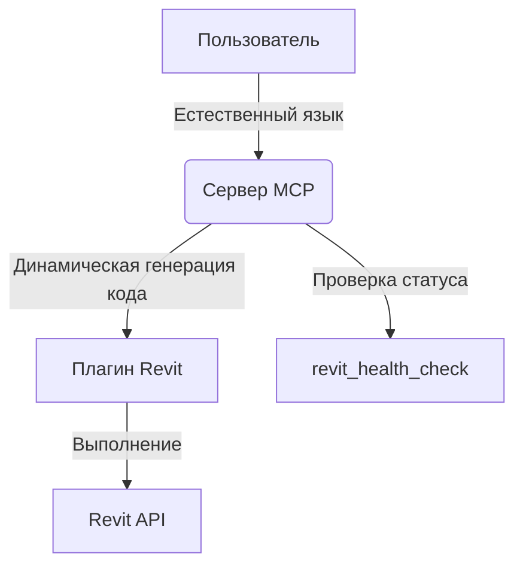

# Smart Revit MCP Server

## Доступные инструменты

- **execute_dynamic_revit_command** — универсальный инструмент для выполнения любых команд в Revit на естественном языке с помощью динамической генерации кода.
- **revit_health_check** — проверка соединения и статуса системы Revit.

### Пример использования динамического инструмента
```typescript
mcp_smart-revit_execute_dynamic_revit_command({
  command_description: "Создай систему вентиляции для офиса с обходом препятствий",
  complexity_level: "complex",
  safety_mode: true,
  optimization_level: "quality",
  parameters: { /* любые параметры, если нужно */ }
})
```

### Проверка соединения
```typescript
mcp_smart-revit_revit_health_check({})
```

**Параметры execute_dynamic_revit_command:**
- `command_description`: Описание команды на русском или английском
- `complexity_level`: `simple | moderate | complex | advanced`
- `safety_mode`: `true` для дополнительных проверок безопасности
- `optimization_level`: `speed | quality | balanced`
- `parameters`: Дополнительные параметры (опционально)

## Архитектура системы

